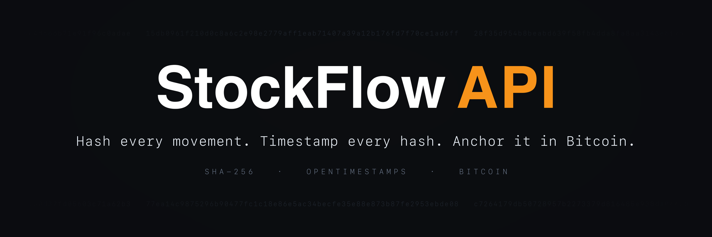

<p align="center">
  
</p>


[](https://documenter.getpostman.com/view/29521779/2sB2qWJ557)
[](LICENSE)

## Description

**StockFlow_API** is a RESTful API developed in Python for **inventory management with blockchain-enhanced security**.  
Each transaction (inbound or outbound) generates a **unique cryptographic hash** that is **timestamped with an immutable marker** using **OpenTimestamps** and later anchored in the **Bitcoin blockchain**.

The system offers:
- Full product CRUD
- Inventory movement operations with integrity control
- Transaction verification and proof download (.ots)

> Target audience: developers, integrators, and teams that need an **auditable** inventory control system with **data integrity assurance**.

---

## Tech Stack

| Layer              | Technology                                |
|--------------------|--------------------------------------------|
| **Language**       | Python 3.14                                |
| **Framework**      | Flask                                      |
| **Database**       | PostgreSQL                                 |
| **ORM**            | SQLAlchemy + Flask-SQLAlchemy              |
| **Migrations**     | Flask-Migrate + Alembic                    |
| **Blockchain**     | OpenTimestamps (attached to Bitcoin)       |
| **Hashing**        | SHA-256 via `hashlib`                      |
| **Time Proof**     | `ots stamp` + `ots verify` (CLI)           |
| **Authentication** | JWT (`PyJWT`) with encrypted password (`bcrypt`) |
| **Serialization**  | Marshmallow                                |
| **Env Management** | python-dotenv                              |
| **Dependencies**   | uv (`pyproject.toml` + `uv.lock`)          |
| **Containerization**| Docker + Docker Compose                   |

---

## How does blockchain protection work?

Each inventory movement generates:
1. A **SHA-256 hash** with the transaction data
2. A `.ots` file (OpenTimestamps), which records this hash with a timestamp
3. This `.ots` is submitted to **public calendars**, which later **anchor the timestamp in the Bitcoin blockchain**

With this, it is possible to:
- Prove that the transaction occurred at a certain moment
- Ensure that the data **was never tampered with**
- Verify and audit any transaction, locally or remotely

---

## Project Structure

```
StockFlow_API/
├── app/
│   ├── auth/                  # Permissions and authentication via JWT
│   ├── controllers/           # Route logic (controller layer)
│   ├── routes/                # RESTful route blueprints
│   ├── schemas/               # Marshmallow schemas for validation/serialization
│   ├── services/              # Business rules (service layer)
│   ├── utils/                 # Helpers: hash, OTS handler, security, formatting
│   └── infraDB/               # ORM models and database connection
│
├── migrations/                # Database version control (Alembic)
├── scripts/                   # Standalone maintenance scripts (admin bootstrap, hashing)
├── ots_data/                  # Folder and .ots files generated dynamically at runtime
├── .env                       # Environment variables (private)
├── .env.example               # Configuration example
├── .gitignore                 # Files ignored by Git
├── LICENSE                    # MIT license
├── app.py                     # Flask application initialization
├── config.py                  # General project configurations
├── pyproject.toml             # Project metadata and dependencies (uv)
├── uv.lock                    # Fully pinned dependency lockfile
├── .python-version            # Python version used by uv
└── README.md                  # Main documentation
```

---

## Environment Variables

This project uses environment variables to configure the database connection, API security, and the path to save .ots proof files.

A template .env.example file is included in the repository to make initial setup and configuration easier. Just copy and rename it to .env.

---

## Manual Setup (without Docker)
> Follow the steps below to run the StockFlow_API application in your local environment:

### 1. Clone the repository
```bash
git clone https://github.com/eduzin3983/StockFlow_API.git
```
```bash
cd StockFlow_API/
```

### 2. Install uv
> Skip this step if you already have [uv](https://docs.astral.sh/uv/) installed.
```bash
curl -LsSf https://astral.sh/uv/install.sh | sh   # On Linux/Mac
```
```powershell
powershell -c "irm https://astral.sh/uv/install.ps1 | iex"   # On Windows
```

### 3. Install dependencies
> `uv sync` creates the `.venv`, installs the exact versions from `uv.lock`, and downloads Python 3.14 if needed.
```bash
uv sync
```

### 4. Configure environment variables
> Copy the example file and edit it according to your environment.

### 5. Initialize the database
> `uv run` executes the command inside the project environment, so there is no venv to activate.
```bash
uv run flask db upgrade
```

### 6. Run the application
```bash
uv run flask run
```
> The API will be available at: http://localhost:5001

## Running with Docker
> The project includes a complete Docker environment for quick and reproducible setup. This includes the Flask API and a PostgreSQL container with volume persistence.

### 1. Create a `.env` file from the example
```bash
cp .env.example .env
```

### 2. (Optional) Adjust default admin credentials
Inside .env, change the values:
```env
ADMIN_EMAIL=admin@email.com
ADMIN_PASSWORD=admin123
```
> These will be used to create the first admin user automatically when the container runs.

### 3. Run the full stack with Docker Compose
```env
docker compose up --build
```
### 4. Finished!
> The API will be available at: http://localhost:5001

### Stopping and cleaning Docker!
```bash
docker compose down
```
> This will stop the containers but preserve the data stored in the volume pgdata.

If you want to remove the volume too:
```bash
docker compose down -v
```
---

## Initial Access and Creation of the First User

For **security** reasons, the system **does not have a public user registration endpoint**.  
The creation of new users must be done **exclusively by authenticated administrators**.

### How to create the first user?

Since there is no pre-registered administrator, the first user **must be inserted manually into the database** via SQL.

To do this, generate an encrypted `password_hash` using the script included in the project:

#### Script: `generate_password.py`

```bash
uv run python -m scripts.generate_password
```
> Enter the desired password (e.g.: admin123) and copy the generated hash.

Then, execute the command below in your PostgreSQL database (adjust the fields as necessary):

```sql
INSERT INTO users (name, email, password_hash, permission, create_at)
VALUES (
  'Admin',
  'admin@email.com',
  'PASSWORD_HASH', -- BCRYPT HASH
  'admin',
  CURRENT_DATE
);
```

### User flow security
- There is no public registration (signup) available in the API

- Only authenticated administrators can register, edit, and remove users

- This ensures complete control over access and prevents the creation of unauthorized accounts

### After manually registering the first admin, you will be able to:

- Log in using the /api/login endpoint

- Use the returned JWT token to access protected endpoints

- Create other users using the /api/users/create endpoint

---

## Postman

You can test all API endpoints directly with the resources below:

[](https://www.postman.com/edu3983/stockflow-api/overview)   
Access the complete collection directly in Postman Web

[Postman Documentation](https://documenter.getpostman.com/view/29521779/2sB2qWJ557)  
View examples, schemas, and detailed descriptions of the endpoints

After login, the JWT token is automatically saved as the `token` variable and used in all authenticated requests.

---

## API Reference

### Authentication

| Method | Route        | Description                          | Permission |
|--------|--------------|--------------------------------------|------------|
| POST   | `/api/login` | Authenticates the user and returns a JWT token | Public     |

---

### Users

| Method | Route               | Description                       | Permission |
|--------|--------------------|-----------------------------------|------------|
| GET    | `/api/users`       | Lists all users                   | Admin      |
| GET    | `/api/users/<id>`  | Gets a user by ID                 | Admin      |
| POST   | `/api/users/create`       | Creates a new user                   | Admin      |
| PUT    | `/api/users/update/<id>`  | Updates user data                   | Admin      |
| DELETE | `/api/users/<id>`  | Removes a user                    | Admin      |

---

### Products

| Method | Route                  | Description                      | Permission |
|--------|-----------------------|----------------------------------|------------|
| GET    | `/api/products`       | Lists all products               | Viewer     |
| GET    | `/api/products/<id>`  | Gets product by ID               | Viewer     |
| POST   | `/api/product/create` | Creates a new product            | Admin      |
| PUT    | `/api/product/update/<id>`  | Updates product data                 | Admin      |
| DELETE | `/api/product/delete/<id>`  | Removes a product from the system    | Admin      |

---

### Transactions (Inventory)

| Method | Route                                | Description                                         | Permission |
|--------|-------------------------------------|-----------------------------------------------------|------------|
| POST   | `/api/transactions/entry`           | Records inventory entry                             | Operator   |
| POST   | `/api/transactions/exit`            | Records inventory exit                              | Operator   |
| GET    | `/api/transactions`                 | Lists all transactions                              | Viewer     |
| GET    | `/api/transactions/<id>`            | Gets transaction by ID                              | Viewer     |
| GET    | `/api/transactions/by-product/<id>` | Lists transactions of a specific product            | Viewer     |
| GET    | `/api/user/transactions`            | Lists transactions of the authenticated user        | Viewer     |
| DELETE | `/api/transactions/delete/<id>`     | Removes a transaction                               | Admin      |

---

### Blockchain & Proof of Integrity

| Method | Route                              | Description                                               | Permission |
|--------|-----------------------------------|-----------------------------------------------------------|------------|
| POST   | `/api/transactions/verify`       | Manually verifies a `.ots` via file name                 | Viewer     |
| GET    | `/api/transactions/<id>/ots`     | Downloads the transaction's `.ots` file                  | Viewer     |
> Note: the `.ots` timestamp may take a few minutes to be confirmed on the Bitcoin blockchain. The status may be "pending" in the first checks.

---

## Contribution

1. Create a branch (`feature/feature-name`)
2. Clear and objective commits (`feat: description`, `fix: description`)
3. Open a PR to the main branch
4. Wait for review and merge

---

## Author(s)

- [Eduardo Kairalla](https://github.com/eduzin3983)
- Contributors are welcome!

---

## License

Distributed under the MIT License. See [LICENSE](LICENSE) for the full text.

<h3 align="center"><sub>Made with code and coffee</sub></p>